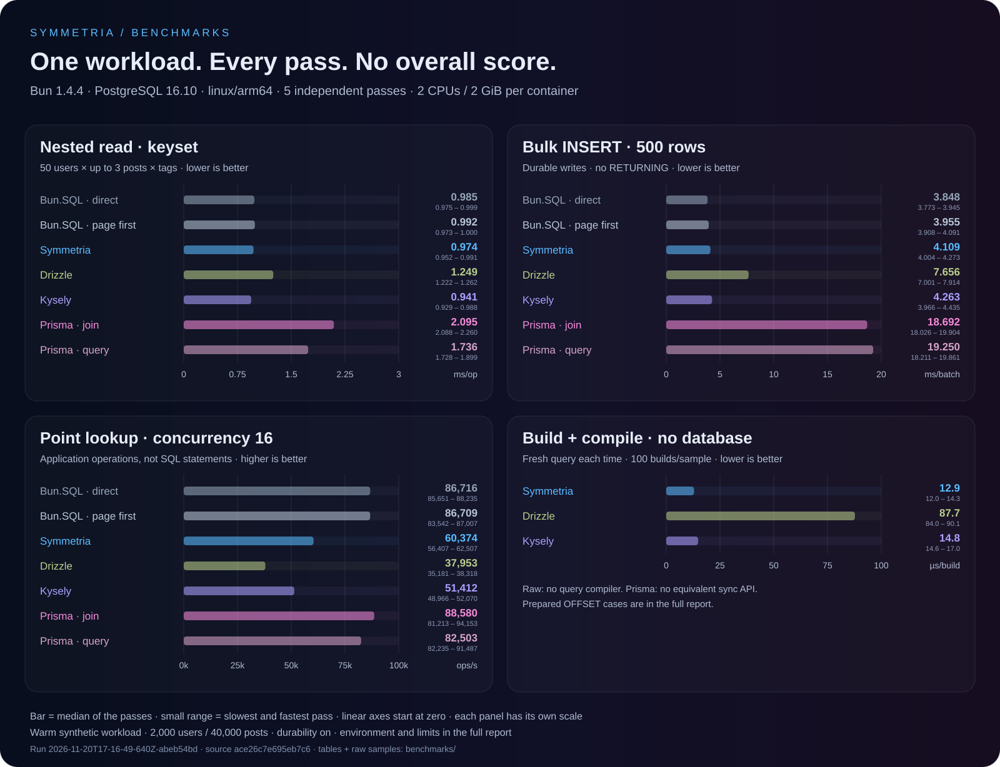

# PostgreSQL benchmark · results

[Run and methodology](../README.md) · [Data and checksums](summary.json)

**5 independent passes · 8 adapters · one complete run.**
Run: `2026-11-17T20-52-09-593Z-9dfc7cf4`. All numbers are recomputed from this run's verified raw samples.

## Common operations

Median sequential p50 across passes, **ms/op; lower is better**. INSERT 500 uses ms/batch. Includes build, bind, execute and decode.

| Adapter | Point | List + JOIN | Nested keyset | INSERT 1 | INSERT 500 | UPDATE |
| --- | ---: | ---: | ---: | ---: | ---: | ---: |
| Bun.SQL (direct LATERAL) | 0.011 | 0.083 | 0.990 | 0.530 | 3.780 | 0.510 |
| Bun.SQL (page first) | 0.012 | 0.079 | 1.002 | 0.497 | 3.828 | 0.507 |
| Symmetria | 0.015 | 0.057 | 0.986 | 0.549 | 4.009 | 0.533 |
| Drizzle | 0.020 | 0.136 | 1.236 | 0.531 | 8.213 | 0.550 |
| Kysely | 0.015 | 0.130 | 0.944 | 0.520 | 4.466 | 0.550 |
| Prisma (join) | 0.041 | 0.123 | 2.113 | 0.570 | 18.837 | 0.566 |
| Prisma (query) | 0.037 | 0.129 | 1.707 | 0.565 | 18.891 | 0.575 |

A warm synthetic workload, with latency, throughput, SQL-plan sensitivity and client construction reported separately.

## Reading the results

- **p50 [min–max]**: median of process p50s and their full range across passes, not a confidence interval.
- **p95 / p99**: median process percentiles, omitted below 100 / 1000 samples in any pass. Bulk INSERT has 32 sequential samples per pass, so its tails are omitted.
- **Throughput ×16**: completed application operations / actual wall time, including in-flight drain. Closed-loop load, not a fixed arrival-rate test.
- **SQL/op** is measured sequentially. Prisma supports concurrent unique-lookup batching; throughput counts application operations, not SQL statements.
- Adapter order changes between measurement passes. No passes or outliers are discarded. Identical raw operations outside nested queries provide an additional indication of noise.

## Environment

| Setting | Value |
| --- | --- |
| Runtime | Bun 1.4.4 · linux/arm64 |
| Host / VM | Apple M3 Pro / OrbStack |
| Runner cgroup | CPU quota `200000 100000`; RAM `2147483648` bytes |
| Read phase | ≥ 2000 ms and 100 samples; concurrent ≥ 2000 ms |
| Pool / concurrency | 16 / 16 |
| Dataset | users: 2,000; posts: 40,000; tags: 100; post_tags: 109,747 |
| Dependencies | drizzle-orm 0.45.4; kysely 0.29.7; @prisma/client 7.10.1; @prisma/adapter-pg 7.10.1; pg 8.23.1 |

PostgreSQL: PostgreSQL 16.10 (Debian 16.10-1.pgdg12+1) on aarch64-unknown-linux-gnu, compiled by gcc (Debian 12.2.0-14+deb12u1) 12.2.0, 64-bit. Full settings, durability, image IDs and hashes are in `manifest.json`. Source SHA-256: `9365590e510a551a6f7c1f027e836b6b200ae0abe52b2bf5476af832bfd7c565`.

Prisma uses its official adapter-pg/node-postgres; other adapters use Bun.SQL (Kysely through this suite's dialect). This compares those stacks, including their driver costs. SQL and EXPLAIN ANALYZE are captured outside timing.

## Reads

<strong>Point lookup</strong> · ms/op

One user by primary key; deterministic ID stream.

| Adapter | p50 [min–max], ms/op | p95 | p99 | samples/pass |
| --- | ---: | ---: | ---: | ---: |
| Bun.SQL (direct LATERAL) | 0.011 [0.011–0.011] | 0.045 | 0.047 | 120,572–160,492 |
| Bun.SQL (page first) | 0.012 [0.011–0.018] | 0.046 | 0.050 | 73,049–159,967 |
| Symmetria | 0.015 [0.013–0.048] | 0.055 | 0.060 | 55,381–124,751 |
| Drizzle | 0.020 [0.020–0.024] | 0.056 | 0.064 | 52,122–92,434 |
| Kysely | 0.015 [0.015–0.018] | 0.052 | 0.065 | 75,278–121,492 |
| Prisma (join) | 0.041 [0.037–0.085] | 0.092 | 0.112 | 27,019–48,266 |
| Prisma (query) | 0.037 [0.037–0.047] | 0.073 | 0.096 | 31,660–49,922 |

| Adapter | Sequential ops/s | Concurrent ×16 [min–max] | SQL/op (seq) |
| --- | ---: | ---: | ---: |
| Bun.SQL (direct LATERAL) | 73,503 | 87,087 [82,962–88,510] | 1.00 |
| Bun.SQL (page first) | 64,915 | 86,358 [85,676–87,809] | 1.00 |
| Symmetria | 37,831 | 61,162 [58,857–61,691] | 1.00 |
| Drizzle | 41,756 | 37,936 [34,531–38,698] | 1.00 |
| Kysely | 45,891 | 51,116 [47,528–53,707] | 1.00 |
| Prisma (join) | 18,534 | 95,779 [83,029–98,295] | 1.00 |
| Prisma (query) | 22,925 | 90,675 [83,959–102,344] | 1.00 |

<strong>List + author JOIN</strong> · ms/op

20 published posts with their author; created_at DESC, id DESC.

| Adapter | p50 [min–max], ms/op | p95 | p99 | samples/pass |
| --- | ---: | ---: | ---: | ---: |
| Bun.SQL (direct LATERAL) | 0.083 [0.037–0.087] | 0.091 | 0.099 | 23,553–37,844 |
| Bun.SQL (page first) | 0.079 [0.040–0.083] | 0.091 | 0.106 | 24,591–34,462 |
| Symmetria | 0.057 [0.049–0.097] | 0.111 | 0.149 | 21,794–30,345 |
| Drizzle | 0.136 [0.087–0.139] | 0.155 | 0.276 | 13,671–20,693 |
| Kysely | 0.130 [0.083–0.132] | 0.144 | 0.170 | 14,944–19,422 |
| Prisma (join) | 0.123 [0.106–0.155] | 0.177 | 0.202 | 12,223–16,979 |
| Prisma (query) | 0.129 [0.120–0.142] | 0.225 | 0.258 | 11,175–15,085 |

| Adapter | Sequential ops/s | Concurrent ×16 [min–max] | SQL/op (seq) |
| --- | ---: | ---: | ---: |
| Bun.SQL (direct LATERAL) | 11,923 | 34,583 [30,019–35,994] | 1.00 |
| Bun.SQL (page first) | 13,726 | 31,747 [28,359–33,206] | 1.00 |
| Symmetria | 13,564 | 30,232 [29,063–31,659] | 1.00 |
| Drizzle | 8,031 | 19,903 [18,534–20,816] | 1.00 |
| Kysely | 8,211 | 22,118 [20,452–23,329] | 1.00 |
| Prisma (join) | 7,167 | 19,740 [16,238–20,451] | 1.00 |
| Prisma (query) | 6,339 | 10,135 [9,885–10,378] | 2.00 |

<strong>Nested · first page</strong> · ms/op

50 users × up to 3 posts × tags; OFFSET 0.

| Adapter | p50 [min–max], ms/op | p95 | p99 | samples/pass |
| --- | ---: | ---: | ---: | ---: |
| Bun.SQL (direct LATERAL) | 1.051 [1.044–1.079] | 1.138 | 1.196 | 1,809–1,897 |
| Bun.SQL (page first) | 0.997 [0.990–1.012] | 1.088 | 1.190 | 1,940–2,001 |
| Symmetria | 1.064 [1.054–1.069] | 1.188 | 1.494 | 1,787–1,867 |
| Symmetria (prepared) | 0.939 [0.919–0.972] | 1.007 | 1.137 | 2,029–2,163 |
| Drizzle | 1.293 [1.259–1.415] | 1.661 | 2.084 | 1,264–1,544 |
| Kysely | 1.011 [1.005–1.042] | 1.120 | 1.265 | 1,876–1,969 |
| Prisma (join) | 2.118 [2.107–2.254] | 2.332 | — | 858–936 |
| Prisma (query) | 1.742 [1.715–1.811] | 2.705 | 3.123 | 1,028–1,105 |

| Adapter | Sequential ops/s | Concurrent ×16 [min–max] | SQL/op (seq) |
| --- | ---: | ---: | ---: |
| Bun.SQL (direct LATERAL) | 944 | 930 [795–974] | 1.00 |
| Bun.SQL (page first) | 993 | 883 [830–909] | 1.00 |
| Symmetria | 919 | 1,257 [1,169–1,360] | 1.00 |
| Symmetria (prepared) | 1,052 | 1,345 [1,087–1,463] | 1.00 |
| Drizzle | 739 | 1,605 [1,497–1,618] | 1.00 |
| Kysely | 968 | 1,259 [1,173–1,368] | 1.00 |
| Prisma (join) | 462 | 655 [623–696] | 1.00 |
| Prisma (query) | 532 | 644 [626–672] | 4.00 |

<strong>Nested · keyset</strong> · ms/op

50 users × up to 3 posts × tags; users.id > 1900. No 1900-parent OFFSET discard.

| Adapter | p50 [min–max], ms/op | p95 | p99 | samples/pass |
| --- | ---: | ---: | ---: | ---: |
| Bun.SQL (direct LATERAL) | 0.990 [0.983–1.007] | 1.065 | 1.321 | 1,921–1,999 |
| Bun.SQL (page first) | 1.002 [0.988–1.024] | 1.125 | 1.365 | 1,886–1,982 |
| Symmetria | 0.986 [0.966–1.012] | 1.105 | 1.356 | 1,727–2,044 |
| Drizzle | 1.236 [1.221–1.272] | 1.516 | 1.781 | 1,453–1,588 |
| Kysely | 0.944 [0.938–0.994] | 1.091 | 1.336 | 1,874–2,086 |
| Prisma (join) | 2.113 [2.098–2.357] | 2.404 | — | 823–942 |
| Prisma (query) | 1.707 [1.646–1.961] | 2.581 | — | 962–1,137 |

| Adapter | Sequential ops/s | Concurrent ×16 [min–max] | SQL/op (seq) |
| --- | ---: | ---: | ---: |
| Bun.SQL (direct LATERAL) | 977 | 1,155 [1,004–1,253] | 1.00 |
| Bun.SQL (page first) | 970 | 1,108 [1,070–1,171] | 1.00 |
| Symmetria | 994 | 1,533 [1,376–1,617] | 1.00 |
| Drizzle | 782 | 1,616 [1,518–1,665] | 1.00 |
| Kysely | 1,027 | 1,514 [1,397–1,600] | 1.00 |
| Prisma (join) | 462 | 693 [635–759] | 1.00 |
| Prisma (query) | 557 | 678 [590–695] | 4.00 |

## Writes

<strong>INSERT · one row</strong> · ms/op

One row with RETURNING id; 256 sequential operations and 64 per concurrent worker.

| Adapter | p50 [min–max], ms/op | p95 | p99 | samples/pass |
| --- | ---: | ---: | ---: | ---: |
| Bun.SQL (direct LATERAL) | 0.530 [0.491–2.105] | 0.679 | — | 256–256 |
| Bun.SQL (page first) | 0.497 [0.478–0.586] | 0.682 | — | 256–256 |
| Symmetria | 0.549 [0.520–0.571] | 0.726 | — | 256–256 |
| Drizzle | 0.531 [0.517–0.562] | 0.697 | — | 256–256 |
| Kysely | 0.520 [0.454–0.574] | 0.696 | — | 256–256 |
| Prisma (join) | 0.570 [0.550–0.584] | 0.692 | — | 256–256 |
| Prisma (query) | 0.565 [0.545–0.569] | 0.714 | — | 256–256 |

| Adapter | Sequential ops/s | Concurrent ×16 [min–max] | SQL/op (seq) |
| --- | ---: | ---: | ---: |
| Bun.SQL (direct LATERAL) | 1,796 | 14,877 [12,989–15,283] | 1.00 |
| Bun.SQL (page first) | 1,702 | 13,628 [3,679–15,596] | 1.00 |
| Symmetria | 1,686 | 13,282 [12,298–14,798] | 1.00 |
| Drizzle | 1,799 | 10,530 [6,580–13,397] | 1.00 |
| Kysely | 1,775 | 13,468 [11,485–15,024] | 1.00 |
| Prisma (join) | 1,709 | 12,380 [10,301–13,370] | 1.00 |
| Prisma (query) | 1,718 | 13,861 [12,392–14,147] | 1.00 |

<strong>INSERT · 500 rows</strong> · ms/batch

500 rows without RETURNING; 32 sequential batches and 4 per worker. One operation is one 500-row batch.

| Adapter | p50 [min–max], ms/batch | p95 | p99 | samples/pass |
| --- | ---: | ---: | ---: | ---: |
| Bun.SQL (direct LATERAL) | 3.780 [3.750–4.053] | — | — | 32–32 |
| Bun.SQL (page first) | 3.828 [3.808–4.068] | — | — | 32–32 |
| Symmetria | 4.009 [3.894–4.514] | — | — | 32–32 |
| Drizzle | 8.213 [7.591–8.816] | — | — | 32–32 |
| Kysely | 4.466 [4.139–4.599] | — | — | 32–32 |
| Prisma (join) | 18.837 [18.568–20.076] | — | — | 32–32 |
| Prisma (query) | 18.891 [18.412–20.633] | — | — | 32–32 |

| Adapter | Sequential batches/s | Concurrent ×16 [min–max] | SQL/op (seq) |
| --- | ---: | ---: | ---: |
| Bun.SQL (direct LATERAL) | 252 | 458 [451–559] | 1.00 |
| Bun.SQL (page first) | 253 | 409 [399–439] | 1.00 |
| Symmetria | 235 | 448 [433–514] | 1.00 |
| Drizzle | 123 | 260 [235–280] | 1.00 |
| Kysely | 222 | 446 [384–512] | 1.00 |
| Prisma (join) | 52 | 63 [58–63] | 1.00 |
| Prisma (query) | 51 | 62 [56–65] | 1.00 |

<strong>UPDATE · bigint increment</strong> · ms/op

Atomic views = views + 1 with RETURNING views; 512 sequential operations and 128 per worker.

| Adapter | p50 [min–max], ms/op | p95 | p99 | samples/pass |
| --- | ---: | ---: | ---: | ---: |
| Bun.SQL (direct LATERAL) | 0.510 [0.481–0.668] | 0.635 | — | 512–512 |
| Bun.SQL (page first) | 0.507 [0.498–0.575] | 0.682 | — | 512–512 |
| Symmetria | 0.533 [0.498–0.577] | 0.694 | — | 512–512 |
| Drizzle | 0.550 [0.527–0.598] | 0.761 | — | 512–512 |
| Kysely | 0.550 [0.502–0.588] | 0.815 | — | 512–512 |
| Prisma (join) | 0.566 [0.516–0.632] | 0.801 | — | 512–512 |
| Prisma (query) | 0.575 [0.554–0.586] | 0.733 | — | 512–512 |

| Adapter | Sequential ops/s | Concurrent ×16 [min–max] | SQL/op (seq) |
| --- | ---: | ---: | ---: |
| Bun.SQL (direct LATERAL) | 1,874 | 14,876 [4,483–15,852] | 1.00 |
| Bun.SQL (page first) | 1,828 | 14,486 [13,917–15,173] | 1.00 |
| Symmetria | 1,674 | 14,110 [13,331–14,309] | 1.00 |
| Drizzle | 1,637 | 12,485 [11,839–14,676] | 1.00 |
| Kysely | 1,642 | 13,028 [12,052–13,739] | 1.00 |
| Prisma (join) | 1,592 | 11,206 [9,399–12,059] | 1.00 |
| Prisma (query) | 1,660 | 12,536 [10,501–13,298] | 1.00 |

## Plan experiment: OFFSET depth

Direct LATERAL and page-first raw return the same data but limit parents at different stages. Kysely can also express page-first SQL. The OFFSET gap belongs to these specific query plans, not an intrinsic ORM or compiler speed ratio.

<strong>Nested · OFFSET 1000</strong> · ms/op

Same shape, OFFSET 1000. Tests SQL-plan sensitivity to page depth.

| Adapter | p50 [min–max], ms/op | p95 | p99 | samples/pass |
| --- | ---: | ---: | ---: | ---: |
| Bun.SQL (direct LATERAL) | 18.987 [18.755–19.425] | 20.633 | — | 102–106 |
| Bun.SQL (page first) | 1.056 [1.035–1.071] | 1.167 | 1.550 | 1,808–1,889 |
| Symmetria | 1.107 [1.096–1.122] | 1.203 | 1.423 | 1,724–1,804 |
| Symmetria (prepared) | 1.023 [0.972–1.042] | 1.130 | 1.309 | 1,852–2,040 |
| Drizzle | 19.846 [19.773–21.645] | 21.609 | — | 100–101 |
| Kysely | 18.007 [17.383–18.491] | 19.288 | — | 107–113 |
| Prisma (join) | 35.098 [34.766–37.313] | 36.651 | — | 100–100 |
| Prisma (query) | 1.766 [1.726–1.843] | 2.680 | 3.016 | 1,015–1,094 |

| Adapter | Sequential ops/s | Concurrent ×16 [min–max] | SQL/op (seq) |
| --- | ---: | ---: | ---: |
| Bun.SQL (direct LATERAL) | 51 | 40 [37–40] | 1.00 |
| Bun.SQL (page first) | 925 | 992 [801–1,067] | 1.00 |
| Symmetria | 875 | 1,231 [1,079–1,409] | 1.00 |
| Symmetria (prepared) | 959 | 1,307 [1,164–1,402] | 1.00 |
| Drizzle | 49 | 33 [31–37] | 1.00 |
| Kysely | 54 | 40 [38–44] | 1.00 |
| Prisma (join) | 28 | 21 [20–23] | 1.00 |
| Prisma (query) | 533 | 664 [605–700] | 4.00 |

<strong>Nested · OFFSET 1900</strong> · ms/op

Same shape, OFFSET 1900. Compare with page-first raw and keyset to distinguish plan cost from client overhead.

| Adapter | p50 [min–max], ms/op | p95 | p99 | samples/pass |
| --- | ---: | ---: | ---: | ---: |
| Bun.SQL (direct LATERAL) | 34.775 [34.545–34.967] | 37.092 | — | 100–100 |
| Bun.SQL (page first) | 1.100 [1.092–1.103] | 1.217 | 1.392 | 1,746–1,799 |
| Symmetria | 1.150 [1.144–1.165] | 1.312 | 1.475 | 1,647–1,723 |
| Symmetria (prepared) | 1.060 [1.022–1.120] | 1.203 | 1.433 | 1,738–1,938 |
| Drizzle | 36.994 [36.421–37.167] | 39.310 | — | 100–100 |
| Kysely | 32.963 [31.908–34.304] | 34.759 | — | 100–100 |
| Prisma (join) | 65.290 [63.888–67.637] | 68.070 | — | 100–100 |
| Prisma (query) | 1.830 [1.741–1.920] | 2.700 | — | 973–1,081 |

| Adapter | Sequential ops/s | Concurrent ×16 [min–max] | SQL/op (seq) |
| --- | ---: | ---: | ---: |
| Bun.SQL (direct LATERAL) | 28 | 21 [20–21] | 1.00 |
| Bun.SQL (page first) | 889 | 859 [795–1,060] | 1.00 |
| Symmetria | 844 | 1,169 [1,138–1,323] | 1.00 |
| Symmetria (prepared) | 921 | 1,170 [1,099–1,361] | 1.00 |
| Drizzle | 27 | 18 [16–19] | 1.00 |
| Kysely | 30 | 22 [21–23] | 1.00 |
| Prisma (join) | 15 | 11 [11–11] | 1.00 |
| Prisma (query) | 512 | 643 [596–692] | 4.00 |

## Client only

<strong>Build + compile · nested query</strong> · µs/build

Fresh builder and SQL per operation, without database I/O or await. Each sample averages 100 builds; includes construction, not just compilation.

| Adapter | p50 [min–max], µs/build | p95 | p99 | samples/pass |
| --- | ---: | ---: | ---: | ---: |
| Symmetria | 12.424 [12.181–13.771] | 17.809 | 21.647 | 1,316–1,492 |
| Drizzle | 85.246 [82.798–95.833] | 100.798 | — | 201–235 |
| Kysely | 14.921 [14.539–16.529] | 19.476 | 21.992 | 1,147–1,328 |

This scenario measures fresh query construction and synchronous SQL compilation for Symmetria, Drizzle and Kysely. Raw has no ORM compiler; Prisma has no equivalent public synchronous API. Prepared/cache-hit timings are excluded.

## Scope

One dataset size, mostly uniform relation density, warm cache and concurrency 1/16. Cold starts, WAN, HTTP serialization, sustained writes, transactions, skew and saturation curves are outside this run. Short fixed write budgets measure bursts, not steady-state ingestion capacity.

CPU quotas cap usage without reserving cores. Containers on macOS share the VM and host. Prepared Symmetria has three OFFSET cases only. Prisma query can fetch additional intermediate rows; normalization is only used by the correctness oracle, outside timing.
